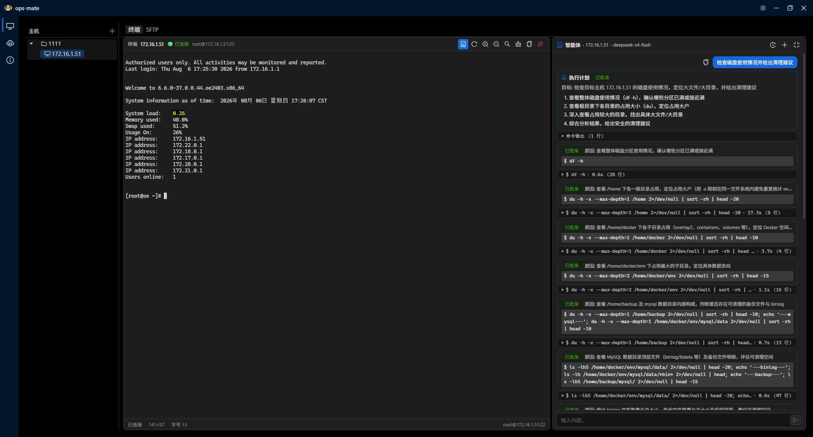
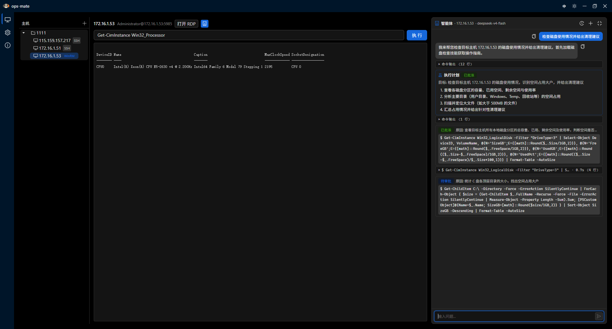
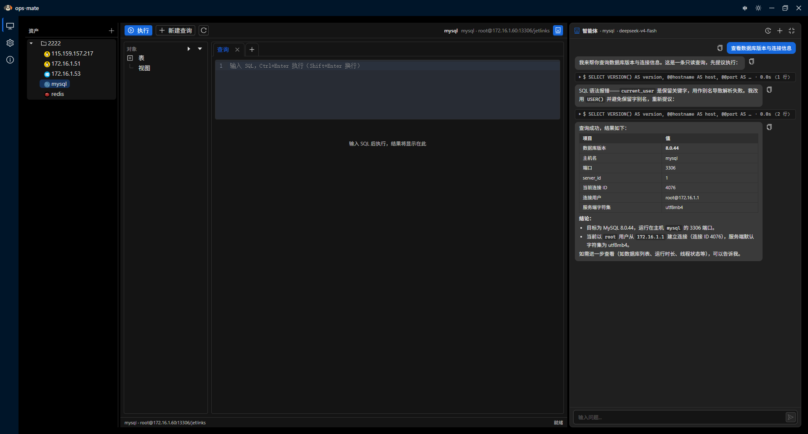
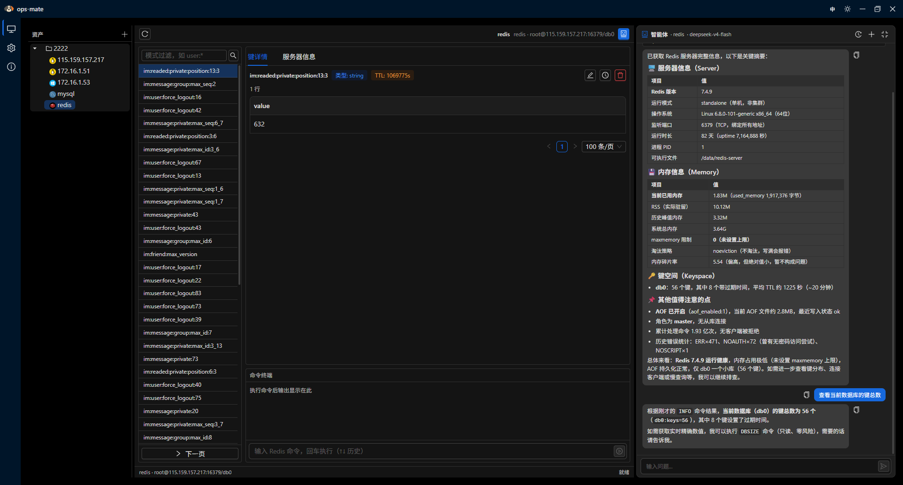

# ops-mate

**ops-mate** 是一款基于 [Wails v2](https://wails.io/)（Go 后端 + React/TypeScript 前端）的 **SSH / WinRM / 数据库** 运维管理桌面应用。它把经典的 SSH/SFTP/WinRM 客户端与 **AI 运维智能体** 结合，智能体可以规划并执行服务器上的诊断/修复任务——每一步都需要你审批确认。



## 功能特性

### 🖥️ 主机管理
- 文件夹**树状**组织主机（新建 / 重命名 / 移动 / 删除节点）
- 管理 **SSH / WinRM / 数据库** 连接资产（SSH、WinRM、MySQL、PostgreSQL、SQLite、Redis 等连接类型由注册表驱动，driver 专属参数按 schema 动态表单录入）
- 保存前可**测试连接**；支持临时执行命令
- 密码等敏感信息**加密落盘**

### 🪟 Windows 主机（WinRM）
- 通过 **WinRM** 连接 Windows 主机（HTTP 5985 / HTTPS 5986，密码认证）
- 打开 Windows 主机即进入**智能体对话页**（不再有独立 PowerShell 命令面板）；在 AI 面板头部**一键拉起远程桌面（RDP）**，密码经 Windows DPAPI 预填
- AI 智能体在 Windows 主机上以 **PowerShell** 运维，含协议感知的安全护栏



### 💻 SSH 终端
- 完整交互式终端（xterm.js，WebGL/Canvas 渲染）—— **仅 SSH 主机**
- 动态**调整大小**、搜索、复制粘贴、命令历史
- 支持多台主机并发会话

### 📁 SFTP 文件传输
- 浏览远程目录，新建 / 删除 / 重命名 —— **仅 SSH 主机**
- **上传 / 下载** 并发队列
- 每个任务独立**进度**，支持暂停 / 继续 / 取消

### 🗄️ 数据库工作台
- 连接 **MySQL / PostgreSQL / SQLite**（SQLite 为本地文件，无需主机/端口/凭据）
- **Navicat 风格工作台**：对象树（表 / 视图分组、一键展开/收缩）、**多标签查询**编辑器、双击表**分页浏览数据**、结果网格（行数 / 耗时 / **CSV 导出**）、状态栏
- AI 智能体在数据库资产上以 `execute_sql` 工具诊断/修复，**每条 SQL 经你批准后执行**



### 🔴 Redis 管理
- 专属 **Redis 面板**：键空间浏览（SCAN 分页 + pattern 过滤）、键详情**按类型查看值**（string / hash / list / set / zset）
- 可**编辑 string 值**、**删除键**、**设置过期（TTL）**——均带确认
- **命令终端**（redis-cli 风格，↑↓ 历史）与服务器 **INFO** 概览（版本 / 内存 / 连接数）



### 🤖 AI 运维智能体
- 与能"看到"当前选中主机的 LLM 智能体对话
- **工具按资产类型装配**：`execute_command`（SSH/WinRM 的 Shell/PowerShell 命令）与 `execute_sql`（数据库资产的 SQL 查询/写操作），**每条命令 / 每条 SQL 都必须经你批准后才执行**
- **计划模式（`create_plan`）**：面对复杂多步任务，智能体先提交执行计划（目标 + 步骤列表）供你审批，批准后按计划逐步执行
- **安全护栏**：危险操作会明确提示风险，且始终要求显式审批；包含协议感知的 **Linux**（`rm -rf /`、`dd`、`reboot`…）与 **Windows**（`format`、`del /s`、`rd /s`、`diskpart clean`、`shutdown /s`…）危险模式
- 每台主机独立对话历史，支持重命名 / 删除

### ⚙️ 模型配置
- 自带大模型：供应商、模型、Base URL、API Key（**加密落盘**）
- 支持 OpenAI 兼容协议（OpenAI / DeepSeek / 通义 / 智谱 / Moonshot / 火山引擎等）、**Anthropic Claude**、以及本地 **Ollama**

## 技术栈

| 层 | 技术 |
|----|------|
| 外壳 | Wails v2（Go + WebView2） |
| 后端 | Go、[eino](https://github.com/cloudwego/eino) 智能体框架、eino-ext 模型适配器、[masterzen/winrm](https://github.com/masterzen/winrm)（WinRM 客户端）、database/sql 驱动（mysql / postgres / sqlite） |
| 存储 | `modernc.org/sqlite`（纯 Go，无需 CGO）+ GORM + golang-migrate |
| 前端 | React 19、TypeScript、Vite、Ant Design 6、react-router-dom 7、xterm.js |

## 架构

```
┌───────────────────────────── 前端（React） ─────────────────────────────┐
│  HostsPage ► HostTree / Terminal / SFTP 面板 / DbPanel / RedisPanel / AIPanel │
└──────────────────────────────────┬──────────────────────────────────┘
                                   │  Wails 绑定（window.go）
┌──────────────────────────────────▼──────────────────────────────────┐
│  Go 后端（Wails）                                                       │
│  handlers: Hosts · Terminal · Sftp · Sessions · Rdp · Db · Connector│
│  internal/connector: 连接类型注册表 + 能力接口（QueryRunner 等）          │
│  internal/einoagent: model(provider) · tools · session · guardrail  │
│  internal executors: sshexec · winrmexec · dbexec · redis           │
│  internal/store:     hosts · conversations · config · memory        │
└─────────────────────────────────────────────────────────────────────┘
```

- **绑定机制**：Go handler 结构体上的导出方法自动绑定，前端通过 `@wailsjs/go/**` 调用（自动生成，勿手改）。
- **路由**：`react-router-dom` 使用 `HashRouter`（嵌入式 Wails 资源要求）。单一数据源位于 `frontend/src/components/AppLayout/menuConfig.tsx`。
- **无边框窗口**：前端实现自定义标题栏拖拽区域。
- **AI 事件**：智能体通过 Wails 事件向前端推送流式事件（`ai:text`、`ai:command`、`ai:plan`、`run:*`），驱动审批界面。

## 开发

前置依赖：[Go](https://go.dev/dl/)、[Node.js](https://nodejs.org/)、[pnpm](https://pnpm.io/)、[Wails CLI](https://wails.io/docs/gettingstarted/installation)。

```bash
# 实时开发（Go 与前端热重载）
wails dev

# 仅前端（独立 Vite，无 Go 桥接）
cd frontend && pnpm dev
```

## 构建

```bash
# 生产构建
wails build

# 指定平台
wails build -platform windows/amd64
wails build -platform darwin/universal
```

## 目录结构

```
├── main.go                  # Wails 应用入口、绑定
├── internal/
│   ├── handler/             # Wails 绑定的 API handler（主机、终端、SFTP、会话、技能、日志、RDP、数据库、连接注册表、AI 配置、审批策略）
│   ├── connector/           # 连接类型注册表 + 能力接口抽象（Driver / QueryRunner）
│   ├── einoagent/           # AI 智能体（model/provider、tools、session、guardrail、prompt）
│   ├── sshexec/             # SSH 命令执行器（统一 Exec 接口）
│   ├── winrmexec/           # WinRM 命令执行器（同一 Exec 接口）
│   ├── dbexec/              # 数据库执行器（mysql / postgres / sqlite 驱动）
│   ├── redis/               # Redis 连接器（KindDB 型：QueryRunner + Pingable）
│   ├── sftp/                # SFTP 传输引擎（并发队列）
│   ├── skill/               # 运维技能管理与远程脚本执行
│   ├── termctx/             # 终端上下文环形缓冲（AI 上下文注入）
│   └── store/               # SQLite 持久化（主机、会话、配置、记忆、日志、技能）
├── frontend/
│   ├── src/                 # React 应用（页面、组件、hooks）
│   └── wailsjs/             # 自动生成的 Wails 绑定（勿手改）
└── wails.json               # Wails 项目配置
```

## 开源协议

[MIT](LICENSE) © ops-mate contributors
